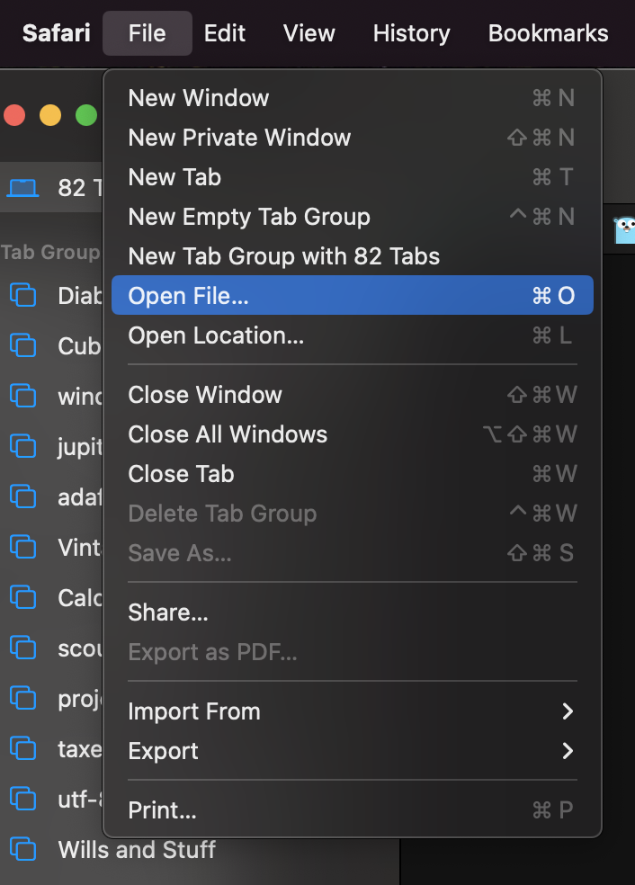
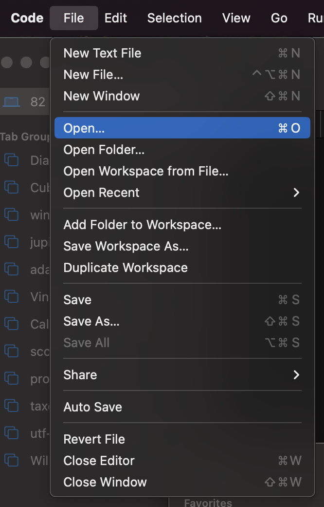
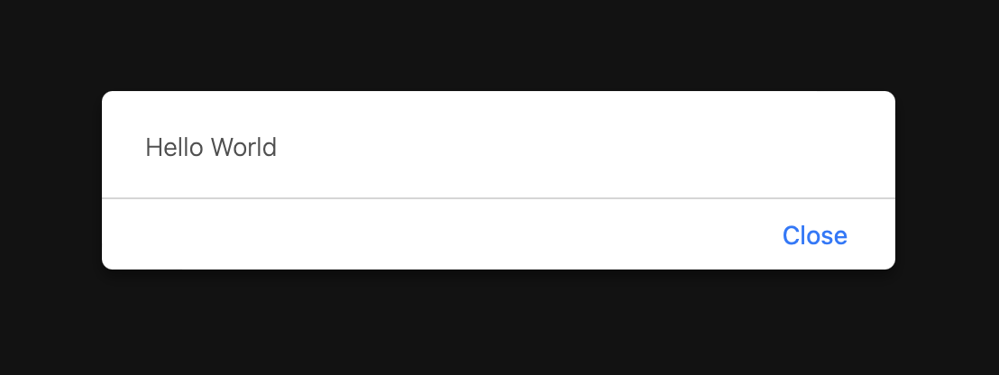
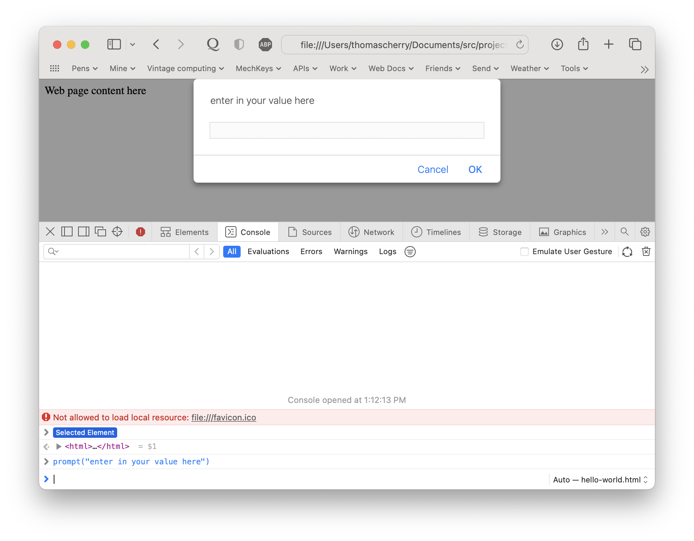

# JavaScript

The language of the ~~gods~~ internet.

## Overview

JavaScript is a programing language built into all web browsers, and is the basis for a web programing environment called Node.js

* Intro, Setup, Tools
* [HTML](02-html-parts.md)
* [Variables](03-variables.md)
* [If](04-if.md)
* [Loops](05-loops.md)
* [Arrays](06-arrays.md)
* Debugging
* Appendix
    * [Operators](a-operators.md)

----

## Intro

JavaScript can be run on any device that has a web browser, because of this, you can program anywhere. All you need is to create an HTML file and to load that page in a browser. HTML stands for Hyper Text Markup Language and is the language of the web. HTML is how a web page tells the web browser what text to show, what size and color to make it and where to put that text. HTML also allows you to include code to add interactive elements to a page. This is how submit buttons check your fields before saving data to the server. It is also how animation works.

## Setup and Tools

To get started programing with java script you will need to create a basic web page. The most basic web page looks like this:

    <!DOCTYPE html>
    <html>
        <head>
            <title>Page Title</title>
            
        </head>
        <body>
            Web page content here
        </body>
    </html>

You can download the file from [here][hello-html]. You will need to save the file after it loads by using "Save As…" from the File menu or pressing control-s on a Windows computer or Command-s on a Mac.

Next you will need a program called a "Text Editor". A text editor is like a word processor but has different features. A text editor will save a file with just the text part of a document. No color, not font information, nothing but text. Word uses a special format to save all this formating information, but a text editor does not, the letters you type are all that show up. All programing languages use text files to store code, and for this reason a Text Editor is needed.

Download one or more of these tools:

| Editor                | Operating System | Notes |
| --------------------- | ---------------- | ----- |
| [BBEdit][bbedit]      | Mac              | 
| [VSCode][vscode]      | Mac/Win/Linux    | Free, runs on most computers
| [Notepad++](noteplus) | Win              |

Once you have installed one of these text editors, and you have downloaded the HTML file from above, you can move on to the next step.

The next step is to open the HTML file in both the text editor and a web browser. To do this, open the text editor and in the "File" menu select "Open". Then in the file dialog box, find the HTML file that was downloaded and select it. Do the same thing in your browser.

## Inspector!

The absolute most coolest feature of a modern web browser which every single one of them have is the Inspector. The Inspector is a place where you can play with the web site settings in real time. You can run code, you can view images, you can change display styles. You can even, in some case, get around limitations web sites put up to viewing content. You can absolutely delete ads.

We want the inspector because you can copy and paste code, you can print out variables and basically do any JavaScript you can think of.

To open up the inspector, right mouse click somewhere on the web page and pick "Inspect Element". Then at the bottom there is an input line, it starts with a ">". Here you type in javascript and when you press enter it runs. If you declare variables in the page, you can access them here. There is a lot of other things in the window, to much to go into on a simple page, but the console tab is what we want and you should play with it.

## Things to know from here
* You need to have a web browser, and a text editor to program web pages
* You need to know how to open an file in each of these
* You need to know how to refresh a page in a web browser to load new changes, normally this is:
    * control-r on a windows machine
    * command-r on a Mac
* The Console tab in the Inspector lets you do anything you want, and is the best place to get started with JavaScript.
---
* previous
* [next](02-html-parts.md)

<!-- Document Links -->
[bbedit]: https://www.barebones.com/products/bbedit/download.html "BBEdit Download"
[vscode]: https://code.visualstudio.com/Download "Visual Studio Code"
[noteplus]: https://notepad-plus-plus.org/downloads/ys
[hello-html]: https://raw.githubusercontent.com/jceaser/nova-hello-world/main/micro-lesons/javascript/hello-world.html "Raw HTML file"