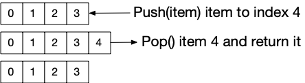

# Arrays

Our next step is to look at arrays so that we can better understand loops. But before we step forward we need to step back and take another look at variables.

## Variable Types
Variables actually have a type, that is they hold different kinds of data. Some of these you have already seen and maybe not have noticed. Data can be either a number, text, boolean, array, or map. There is actually a couple of other like "function" but lets just look at the basic list. The reason we have different types of variables is because we actually want these to values to behave differently when we operate on them. Adding two strings is different then adding two numbers. When we add numbers, we want a new number that is the sum of the two, where as when we add two strings we want them to be glued together.

Further more, there are different types of numbers which need to be treated differently in order to make a computer run faster. Numbers which do not have decimal places calculate much faster then numbers with decimal places. Many, if not most of the time a program will not need decimal places, so by making these numbers different, a programing language can run your code in a more efficient way, all you need to do is give the computer some hints as to what kind of data you want the computer to process. Variable type is one of the ways we do this.

Here is a table of the most common variable types and how we use them:

| Type | Example | Usage | Notes |
| ---- | ------- | ----- | ----- |
| int | 42 | var a = 42 | A simple number with no decimal places |
| float | 3.14 | var a = 3.14 | A "real" number. |
| bool | true | var a = true | Can only be true or false
| string | "Hello World" | var a = "Hello" | A string of characters, text

Converting variables from one type to another in JavaScript can be done using a few commands.

| Function | Example | Input | Output | Notes
| -------- | ------- | ----- | ------ | -----
| To String | var a = String(3.14) | Float, Int, or String | String
| To Number | var a = Number("3.14") | Float, Int, or String | Float, Int, or NaN
| To Float | var a = parseFloat("3.14") | Float, Int, or String | Float, or NaN
| To Int | var a = parseInt("3.14") | Float, Int, or String | Int, or NaN | Will not round, drops decimal point

The number commands in this chart show that a special value can be retuned by them called "NaN". NaN starts for "Not A Number" and must be handled with another command called "isNaN()" like this:

    var num;
    do
    {
        num = Number(prompt("Enter in a number"))
    }
    while (isNaN(num))
    alert("Twice the number entered is " + String(num*2))

Code like this is helpfull when a person tries to enter in "two" for a a number which the computer does not know means 2, so it will not be able to convent the string to a number. In this case, you get NaN and JavaScript gives you a way to test for the language specific response in the form of "isNaN()".

## Arrays

Now, we can look at another variable type, a most important one called "Array". An array is a list of values. Arrays are used for cases where you don't have a fixed set of values, like when you want to find an average for a list of grades. A user may enter in a bunch of values and you may want your program to not even care how many there are. Arrays look a lot like any other data type in JavaScript but you need to create them in a special way. You use square brackets ("[]") and commas.

    var list = []
    var fruits = ["apple", "bannana", "orange"]

The first line shows how you create an empty list, the second shows a pre-populated list.

You can do a few extra things with lists that you can not do with other variables. Specifically you can ask an array: How many do you have, Give me a specific item, and append a value.

### Length - how many

Getting a length of an array uses the "dot" notation. This is where you give a command to a variable using a dot to separate them like this:

    var fruits = ["apple", "bannana", "orange"]
    alert(fruits.length)

### Specific items

Get a specific item from an array using the square bracket notation and the "index" number:

    var fruits = ["apple", "bannana", "orange"]
    alert("First item is " + fruits[0])
    alert("Last item is " + fruits[fruits.length-1])

This show you how to get the first and last item from an array but it probably looks really strange. Up until now we have not had to deal with one very strange fact about programing languages. Computers, unlike humans, always ALWAYS, **ALWAYS** start counting from zero. The most common mistake a programer can make is "being off by one", meaning they forgot this. The first item in an array is the "zero" item, Length is normal, you have 5 items, you get 5 back. You want the 5th item from an array, it's _at_ 4 (5-1). When we look at for loops again, we will see this very clearly.

### appending items

To add items to an array, you also use the dot notation with the "push" command. Push means to "push a value into an array" and is related to something called a "stack" which is a way to treat arrays like a stack of paper where you "push" items onto the stack, and you "pop" them off, but we will just use the push here because it is really easy to use:

    var fruits = ["apple", "bannana", "orange"]
    fruits.push("pineapple")
    alert(fruits)

if you really must know, "pop" will remove the last aded item and return it to you:

    var fruits = ["apple", "bannana", "orange"]
    var last_item = fruits.pop()
    alert(last_item + " has been removed, now you just have " + fruits)

Visually, if you have an array with 4 items in it, and you add one then remove that item, it looks like this:

## Another look at loops

## for loop

Lets create a program that asks for a bunch of grades and then finds the average of them. To do this, the program will append grades that are numbers until the user says "stop", then use a for loop to find the average:

    var grades = []
    var appending = true
    while (appending)
    {
        var answer = prompt("enter in a number to average")
        if (answer == "stop")
        {
            appending = false
        }
        else
        {
            var value = Number(answer)
            if (!isNaN(value))
            {
                grades.push(value)
            }
        }
    }
    var sum = 0
    for (var index=0 ; index<grades.length ; index++)
    {
        sum = sum + grades[index]
    }
    var average = sum / grades.length
    alert("The average from " + grades + " is " + average)
    
Notice how the for loop is used here, the first section starts our index at 0. Then we set up the test to check that the index is less then the length of grades. It is important to point out that we don't have to subtract 1 from the length because we are using less then. If we had used less then or equals to ("<=") then we would have had to. Finally we increment index after each run of the loop so that when we start it again, index is looking at the next value of the array.

### for of loops

Array processing is so common, it even has it's own style of for loop called the for of loop which cuts out all the work in setting up a standard for loop by assuming you need to create a variable with each item of the list and that you want to process each item in the list, so why bother asking for all the steps.

    var grades = [100, 70, 80]
    var sum = 0
    for (item of grades)
    {
        sum = sum + item
    }
    var average = sum / grades.length
    alert(average)

### for in loop

There is one final form of for loop, the for in loop which we will see with maps latter. For in loops with arrays however allow you to use an array index in case you need or want to use the square bracket notation.

    var grades = [100, 70, 80]
    var sum = 0
    for (index in grades)
    {
        sum = sum + grades[index]
    }
    var average = sum / grades.length
    alert(average)

Mostly the same, and this is a matter of style.

## Thinks to know from here
* Computers start counting at 0!
* Arrays are lists of values
* Arrays have actions you can call using the "dot" notation.

---
* [previous](05-loops.md)
* [next](07-maps.md)
