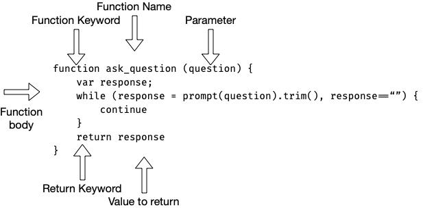

# Functions

There is a saying amongst software developers: "Don't repeat yourself", which means to us that you should not writes lots of code that looks almost exactly alike. You should structure your code to be reusable. Functions are the way we  re-use code.

Functions are not loops, functions are a block of code that you can give a name to. Functions can take optional inputs and can give optional output. You can think of the plus sign as a function, it takes two inputs and gives an output.

## What is the problem

To understand how a function is used, lets take a look at the following code which asks the user a couple of questions:

    var asking
    //ask name
    asking = true
    var name
    while (asking) {
        name = prompt("What is your name?")
        if name!="" {
            asking = false
        }
    }
    //ask quest
    asking = true
    var quest
    while (asking) {
        quest = prompt("What is your quest?")
        if quest!="" {
            asking = false
        }
    }

The top half asks for a users name, and the bottom half asks the user's quest. Both of these sections do mostly the same thing, they enter into a while loop and keep asking the same question till it is not blank.

## Solution

It would be nice to reduce the code above so that the code can be called twice, only sending the information that is different. A function will let us do just that like this:

    function askSomething(question) {
        var asking = true
        var answer
        while (asking) {
            answer = prompt(question)
            if name!="" {
                asking = false
            }
        }
        return answer
    }

This block of code is a function. It takes a "question" as an input and returns the answer. Inside the function (which the the part between the '{' and '}') is a while loop much like in the original example. The function creates an "asking" variable which can be used to control the while loop.

## Function Syntax

Now that you have seen a real function, here is the basic form of a function:

So now that we have an idea of what a function is, lets see how to use it. The original example up top can be rewritten using the askSomething() function like this:

    //create a function
    function askSomething(question) {
        var asking = true
        var answer
        while (asking) {
            answer = prompt(question)
            if name!="" {
                asking = false
            }
        }
        return answer
    }
    //use the function twice
    var name = askSomething("What is your name?")
    var quest = askSomething("What is your quest?")

That is a great savings in space and in understanding as it is now more clear what your intention is, you want to ask questions and put thet result into values.

> **NOTE**: the two lines above that start with double slash, these are comments. They have no impact on the code and are ignored by JavaScript. Comments are used to document the code, to put in notes for yourself or other developers. Double slash comments are for a single line, if you want a comment to move across multiple lines, use the slash star format like this: `"/* ignore this */".`

## Function features

Functions are like mini programs. Actions that take place inside a function normally stay inside that function. This means that if you create a variable, that variable is only usable inside the function. Any memory you use is returned to the computer when the function ends, unless you return the value with a return statment. This allows us to not have to worry about the "asking" variable in the main code as this value is only usable and important to the code that asks the user a question. We use functions to segment code into blocks which are tasked with specific jobs to do. Any value needed to accomplish the function's job can be created inside that function. We call this feature "scope". Scope as in how you are limited in what you see when you look into a telescope. Yes, your looking at something up close, but your focused on a very small section of space ; your vision is "scoped" to just what fits in the lense.

Function variables are "scoped" to the function, they exist only whet the function runs.

Another feature of functions is the ability to take input values. To truly make a function reusable, you have to have all the common code and not any of the parts that make the use of that function specific to one specific run. In our example, we don't write out the question text in the function, but instead we use an input variable. That way, the code that runs the function can pass in the string for the question to ask (which is the only part that is different in each run of the function. In our example, `question` is the variable listed after the function name inside the '(' and ')' section of the function. `question` can then be uses everywhere you would want the question. We use it in the `prompt()`.

Final, functions return a value. This value can then be assigned to a value in the main code when the function ends. 

## Thinks to know from here
* 
* Function facilitate reuse of code
* Functions take inputs and return a value
* Variables created inside a function only exist inside that function.

---
* [previous](07-maps.md)
* [next]()
